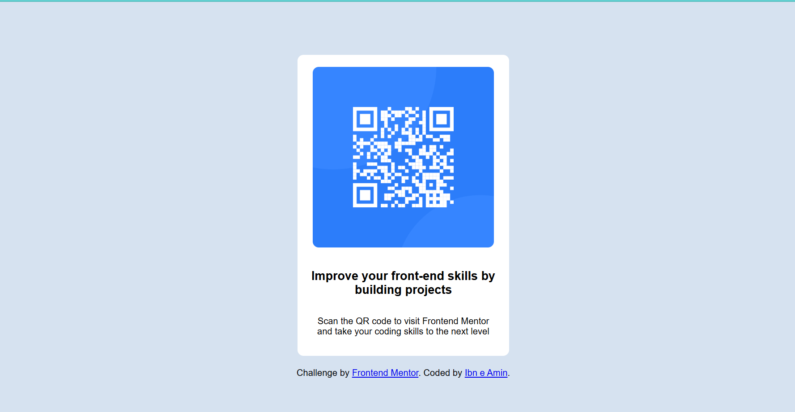

# QR Code Card

A small, responsive QR code card component built with semantic HTML and CSS. This project demonstrates a simple, accessible card layout suitable for practicing layout, spacing, and responsive design.

## Overview

### Screenshot

### Links

- Solution URL: https://your-solution-url.com (https://github.com/IBN-E-AMIN-KHAN/QR-Code-Card)
- Live Site URL: https://your-live-site-url.com (https://ibn-e-amin-khan.github.io/QR-Code-Card/)

## My process

This project was built by reading a brief design and implementing a single-screen component. The goal was to use semantic HTML and modern CSS (Flexbox, CSS variables) to create a centered card that adapts to small screens.

### Built with

- Semantic HTML5 markup
- CSS custom properties (variables)
- Flexbox for layout

### What I learned

- How to center a card both vertically and horizontally using Flexbox
- Using CSS custom properties to manage colors and spacing
- Structuring a small project with semantic elements for accessibility

### Continued development

- Add keyboard focus styles and improve accessibility (ARIA where appropriate)
- Generate the QR image dynamically with a small JavaScript helper
- Add responsive typography and tests for layout regressions

### Useful resources

- Frontend Mentor — great for practice projects and community feedback: https://www.frontendmentor.io/
- MDN Web Docs — Flexbox guide and accessibility references: https://developer.mozilla.org/

### AI Collaboration

- Tools used: GitHub Copilot (optional)
- How: Assisted with small snippets and wording for documentation; main layout and styling were implemented by hand.
- Notes: AI helped speed up boilerplate, but key decisions (accessibility and structure) were manual.

## How to run

1. Clone or download the repository.
2. Open `index.html` in your browser, or run a simple local server from the project root:
   - Python 3: `python -m http.server 8000`
   - Node (http-server): `npx http-server . -p 8000`
3. Visit `http://localhost:8000` to view the demo.

## Project structure

- `index.html` — Demo page showing the QR code card
- `image.png` / `preview.jpg` — Example images used in the demo
- `style-guide.md` — Design tokens and style notes
- `design/` — Design files and assets
- `images/` — Additional assets
- `AGENTS.md`, `CLAUDE.md` — Project notes and assistant configs

## Customization

- Replace `image.png` with your own QR image to point to different content.
- Update CSS variables in `style-guide.md` or the main stylesheet to change colors and spacing.

## Author

Ibn e Amin Khan

## Acknowledgments

Thanks to Frontend Mentor for the challenge and to resources like MDN for learning references.

---

